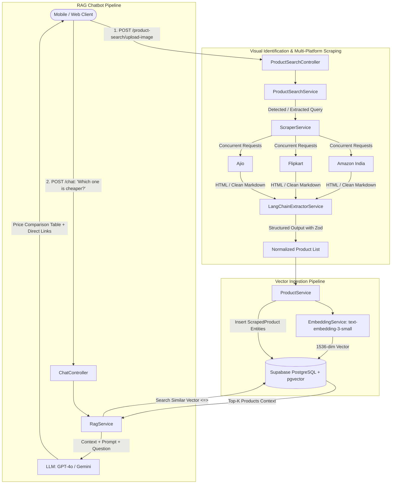

# E-Commerce Visual Search, Web Scraping & RAG Chatbot Engine
## Master Development Documentation & Project Context

> **CRITICAL NOTE FOR AI ASSISTANTS & DEVELOPERS:**
> Always read this document first before adding, modifying, or debugging any features in this repository. It serves as the single source of truth for the system architecture, design decisions, data flow, tool selections, and implementation logic.

---

## 1. Project Overview

This project is an enterprise-grade backend service built with **NestJS**, **Supabase PostgreSQL (`pgvector`)**, **LangChain**, and **OpenAI/Google LLMs**. It powers a multi-platform visual product search and conversational shopping assistant that:
1. **Accepts image uploads** from users to identify products visually.
2. **Scrapes e-commerce platforms concurrently** (Amazon India, Flipkart, Ajio) using headless scrapers and Firecrawl.
3. **Extracts structured product data** (title, price, MRP, rating, links, images) with zero-hallucination guarantees using **LangChain's Structured Output** (`withStructuredOutput` + Zod).
4. **Generates vector embeddings** (768-dimensional) and stores catalog items in **Supabase PostgreSQL with `pgvector`**.
5. **Powers a Conversational RAG Chatbot** that retrieves the most relevant products via cosine similarity (`<=>`), compares prices across platforms, and generates accurate shopping recommendations with clickable links.

---

## 2. Technology Stack & Tools Used

| Layer | Technology | Purpose |
|---|---|---|
| **Framework** | [NestJS v11](https://nestjs.com/) | Scalable server-side TypeScript framework utilizing modular architecture and Dependency Injection. |
| **Language & Runtime** | TypeScript & Node.js | Strict type safety across entities, DTOs, interfaces, and AI chains. |
| **Primary Database** | PostgreSQL via [Supabase](https://supabase.com/) | Managed cloud database hosting user data and product catalog. |
| **Vector Database** | [pgvector](https://github.com/pgvector/pgvector) | Native PostgreSQL extension for high-performance vector similarity search (`vector(3072)`). |
| **ORM** | [TypeORM](https://typeorm.io/) | Object-Relational Mapper connecting NestJS with PostgreSQL and `pgvector`. |
| **AI & LLM Orchestration** | [LangChain](https://js.langchain.com/) (`@langchain/core`, `@langchain/google-genai`) | Prompt templating, structured output parsing, runnable sequences, and embeddings. |
| **LLM Models** | Google Gemini `gemini-3.6-flash`, `gemini-embedding-001` | Fast data extraction, conversational RAG, and 3072-dim embeddings. |
| **Web Scraping** | [Firecrawl](https://www.firecrawl.dev/) (`@mendable/firecrawl-js`) + Fetch/Cheerio fallback | Bypasses e-commerce anti-bot protections and converts dynamic web pages into clean Markdown. |
| **Schema Validation** | [Zod v3](https://zod.dev/) (`3.25.x`) & `class-validator` | Strict schema validation for LangChain outputs and incoming HTTP request DTOs. |
| **File Upload Handling** | Multer (`@nestjs/platform-express`) | Multipart/form-data image processing with MIME-type filtering and 5MB payload limits. |
| **Auth & Security** | `@nestjs/jwt`, `bcrypt` | JWT token generation, password hashing, and route protection guards. |
| **Background Queues** | BullMQ & Redis (`ioredis`) | Asynchronous job scheduling (ready for scheduled or heavy batch scraping jobs). |

---

## 3. End-to-End System Architecture



---

## 4. Directory Structure & File Map

```text
src/
├── ai/                                       # AI, Embeddings, Vision & RAG Engine
│   ├── embedding/
│   │   └── embedding.service.ts              # Generates 3072-dim embeddings via gemini-embedding-001
│   ├── rag/
│   │   └── rag.service.ts                    # LangChain RAG pipeline (retrieves from pgvector, prompts Gemini)
│   ├── vision/
│   │   ├── product-visual-analysis.schema.ts # Zod schema for visual product recognition
│   │   └── vision.service.ts                 # Multimodal Gemini Vision model to detect products from image buffers
│   └── ai.module.ts                          # Exports EmbeddingService, RagService & VisionService
│
├── scraper/                                  # Web Scraping & LangChain Data Extraction
│   ├── extractors/
│   │   └── langchain-extractor/
│   │       └── langchain-extractor.service.ts# Feeds HTML/Markdown to LLM with structured Zod schema
│   ├── interfaces/
│   │   └── product-schema.ts                 # Strict Zod schemas (ScrapedProductItem, ScrapedProductList)
│   ├── scraper.service.ts                    # Orchestrates parallel scraping of Amazon, Flipkart, Ajio
│   └── scraper.module.ts                     # Exports ScraperService and LangChainExtractorService
│
├── product/                                  # Product Data & Vector Search Layer
│   ├── scraped-product.entity.ts             # TypeORM entity with 'vector' column for pgvector
│   ├── product.service.ts                    # Saves products with embeddings & runs cosine similarity queries
│   ├── product.controller.ts                 # Product-related management endpoints
│   └── product.module.ts                     # Imports TypeOrmModule.forFeature([ScrapedProduct])
│
├── product-search/                           # Image Upload & Search Orchestration
│   ├── product-search.controller.ts          # Multipart file upload endpoint (POST /product-search/upload-image)
│   ├── product-search.service.ts             # Coordinates Image -> Scrape -> Vector Ingestion
│   └── product-search.module.ts              # Connects ScraperModule and ProductModule
│
├── chat/                                     # Conversational Chatbot API
│   ├── dto/
│   │   └── chat-query.dto.ts                 # Validates incoming chat message payloads
│   ├── chat.controller.ts                    # Exposes POST /chat endpoint
│   └── chat.module.ts                        # Imports AiModule
│
├── auth/                                     # Authentication & JWT
│   ├── auth.controller.ts                    # User login and registration endpoints
│   ├── auth.service.ts                       # JWT issuance and password verification
│   └── auth.module.ts
│
├── user/                                     # User Profile Management
│   ├── user.entity.ts                        # TypeORM User entity (id, email, password, firstName, lastName)
│   ├── user.controller.ts                    # User CRUD endpoints
│   └── user.service.ts                       # User persistence logic
│
├── guards/                                   # Route Guards
│   └── auth/
│       └── auth.guard.ts                     # JWT Bearer token authentication guard
│
├── app.module.ts                             # Root module configuring TypeORM, ConfigModule, and feature modules
└── main.ts                                   # Application bootstrap entry point
```

---

## 5. Core Implementation Details & Logic

### 5.1. Image Upload Flow (`ProductSearchController` & `ProductSearchService`)
- **Route**: `POST /product-search/upload-image`
- **Interception**: Uses NestJS `FileInterceptor('file')`.
- **Validation**:
  - File size restricted to **5 MB**.
  - MIME-type restricted via regex: `/\/(jpg|jpeg|png|webp)$/`.
- **Processing**:
  1. Receives image buffer.
  2. Identifies product query (e.g. through vision AI or extracted keywords).
  3. Triggers parallel scraping across Amazon, Flipkart, and Ajio via `ScraperService.scrapeAllPlatforms()`.
  4. Automatically stores the scraped results along with vector embeddings into Supabase `pgvector`.
  5. Returns the structured product cards directly to the client.

### 5.2. Web Scraping with LangChain Structured Output (`ScraperService` & `LangChainExtractorService`)
- **The Challenge**: E-commerce platforms (Amazon, Flipkart, Ajio) constantly change CSS selectors and deploy anti-bot systems (Cloudflare, Akamai).
- **The Solution**:
  1. We fetch pages via **Firecrawl** (`@mendable/firecrawl-js`), which renders JavaScript, bypasses bot detection, and converts the webpage into clean Markdown.
  2. The Markdown content is passed to `LangChainExtractorService`.
  3. `ChatOpenAI({ model: 'gpt-4o-mini', temperature: 0 })` runs with `.withStructuredOutput(ScrapedProductListSchema)`.
  4. The model enforces the **Zod schema**:
     ```typescript
     export const ScrapedProductItemSchema = z.object({
       title: z.string(),
       price: z.number(),
       originalPrice: z.number().optional(),
       rating: z.number().optional(),
       productUrl: z.string(),
       imageUrl: z.string(),
       inStock: z.boolean().default(true),
     });
     ```
  5. The output is 100% deterministic JSON with zero parsing bugs or regex failures.

### 5.3. Vector Database Storage with `pgvector` (`ProductService` & `ScrapedProduct`)
- **Database**: Supabase PostgreSQL with `CREATE EXTENSION IF NOT EXISTS vector;`.
- **Entity**:
  ```typescript
  @Entity('scraped_products')
  export class ScrapedProduct {
    @PrimaryGeneratedColumn('uuid')
    id: string;

    @Column()
    platform: string; // 'amazon' | 'flipkart' | 'ajio'

    @Column()
    title: string;

    @Column('decimal', { precision: 10, scale: 2 })
    price: number;

    @Column({ nullable: true })
    originalPrice: number;

    @Column({ nullable: true })
    rating: number;

    @Column()
    productUrl: string;

    @Column()
    imageUrl: string;

    @Column({ type: 'vector', length: 1536, nullable: true })
    embedding: number[];
  }
  ```
- **Embedding Generation**: For each scraped product, `EmbeddingService` generates an embedding of the string: `"${platform} ${title} Price: ${price}"` using OpenAI `text-embedding-3-small`.
- **Vector Similarity Search**:
  When a user searches or chats, the query is embedded and compared using PostgreSQL cosine distance:
  ```typescript
  return await this.productRepo
    .createQueryBuilder('product')
    .orderBy('product.embedding <=> :vector', 'ASC')
    .setParameter('vector', `[${queryEmbedding.join(',')}]`)
    .limit(limit)
    .getMany();
  ```

### 5.4. Conversational RAG Chatbot Pipeline (`RagService` & `ChatController`)
- **Route**: `POST /chat`
- **Body**: `{ "message": "Which platform has the best price for Nike Air Jordan and what are the links?" }`
- **RAG Steps**:
  1. **Retrieval**: `ProductService.searchSimilar(userQuestion, 6)` executes a cosine similarity search against `pgvector` to find top 6 relevant scraped products.
  2. **Context Formatting**: Products are formatted as markdown cards containing platform, title, selling price, MRP, rating, direct link, and image URL.
  3. **Prompt Template**:
     - System prompt instructs the model to act as a price comparison expert.
     - Compares prices across Amazon, Flipkart, and Ajio.
     - Enforces outputting active Markdown links `[Buy on Platform](url)`.
     - Mandates strict adherence to provided context to eliminate hallucinations.
  4. **Execution**: Handled through a LangChain `RunnableSequence` with `StringOutputParser`.

---

## 6. Dependency Graph & Circular Dependency Prevention

Because `ProductModule` needs `EmbeddingService` from `AiModule`, and `AiModule` (via `RagService`) needs `ProductService` from `ProductModule`, a circular dependency exists.

**How this is resolved in the codebase:**
1. In `ProductModule`:
   ```typescript
   imports: [
     TypeOrmModule.forFeature([ScrapedProduct]),
     forwardRef(() => AiModule),
   ]
   ```
2. In `AiModule`:
   ```typescript
   imports: [forwardRef(() => ProductModule)]
   ```
3. In service constructors, `@Inject(forwardRef(() => ...))` is explicitly used:
   - `ProductService`: `@Inject(forwardRef(() => EmbeddingService)) private embeddingService: EmbeddingService`
   - `RagService`: `@Inject(forwardRef(() => ProductService)) private productService: ProductService`

---

## 7. Critical Gotchas & Dependency Rules

> [!WARNING]
> **Do NOT upgrade `zod` to v4!**
> LangChain (`@langchain/core`, `@langchain/openai`, `@langchain/community`) strictly relies on `zod@^3.23.8` or `zod@^3.25.x`. Upgrading to Zod 4 triggers npm `ERESOLVE` dependency conflicts with `@browserbasehq/stagehand` and causes breaking changes in LangChain structured parsers. Keep `"zod": "^3.25.76"` in `package.json`.

> [!NOTE]
> **Direct Vector Searching on Amazon/Flipkart:**
> Amazon, Flipkart, and Ajio do not provide public vector endpoints. Vector matching is performed against products *stored in our local `pgvector` catalog*. The live external search is driven by keywords identified from the user's query or visual image recognition.

---

## 8. Environment Variables Reference (`.env`)

```env
# Supabase PostgreSQL connection with SSL enabled
DATABASE_URL=postgresql://<user>:<password>@<host>:5432/<db>

# JWT Authentication Secret
JWT_SECRET=your_jwt_secret_key_here

# OpenAI API Key for Embeddings (text-embedding-3-small) and LLM Extraction/RAG (gpt-4o / gpt-4o-mini)
OPENAI_API_KEY=sk-proj-xxxxxxxxxxxxxxxxxxxxxxxx

# Firecrawl API Key for automated web scraping with bot-bypass
FIRECRAWL_API_KEY=fc-xxxxxxxxxxxxxxxxxxxxxxxx
```

---

## 9. API Reference Summary

| Method | Endpoint | Request Type | Description |
|---|---|---|---|
| `POST` | `/product-search/upload-image` | `multipart/form-data` (`file`) | Uploads product image, triggers multi-platform scrape, saves vectors, and returns matching products. |
| `POST` | `/chat` | `application/json` (`{ "message": "..." }`) | Queries the RAG shopping chatbot for price comparisons and recommendations. |
| `POST` | `/auth/register` | `application/json` | Registers a new user account. |
| `POST` | `/auth/login` | `application/json` | Authenticates user and returns JWT access token. |
| `GET` | `/user` | Bearer JWT | Retrieves user profile data. |

---

## 10. Verification & Build Commands

- **Build Project**: `npm run build`
- **Start in Watch Mode**: `npm run start:dev`
- **Run Unit Tests**: `npm run test`
- **Lint Code**: `npm run lint`
